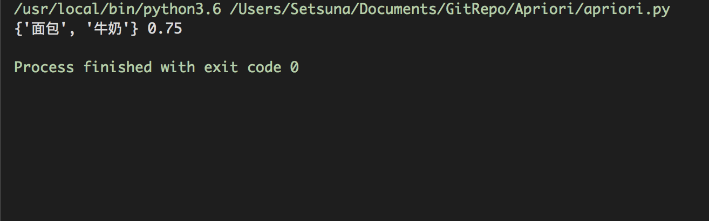

### 一、 先验算法

---

> **输入**

​	数据集合D，支持度阈值α 

> **输出**

​	最大的频繁k项集

> 伪代码


### 二、程序说明

------

#### 1. 工具包清单

- numpy


#### 2. 模块功能

> Apriori 类

```python 
def __init__(self):
    self.freq_set = []  # 频繁项集
    return
```

```python
def fit(self, database, threshold):
    """
    计算最大频繁项集
    :param database: 数据库
    :param threshold: 阈值
    :return:
    """
    pass
```

```python
def __concentrate__(self):
    """
    更新频繁项集
    :return: 
    """
    pass
```

```python
def __update_sup__(self):
    """
    更新支持度
    :return: 
    """
    pass
```

```python
def __cut__(self, threshold):
    """
    剪枝，删除支持度小于阈值的项集。
    :param threshold: 阈值
    :return: 
    """
    pass
```


### 三、程序测试

------

#### 1. 测试程序

```python
if __name__ == '__main__':
    # 数据库
    database = [["面包", "牛奶", "啤酒", "尿布"],
                ["面包", "牛奶", "啤酒"],
                ["啤酒", "尿布"],
                ["面包", "牛奶", "花生"]]
    apr = Apriori() 		# 声明Apriori类
    apr.fit(database, 0.7)	#计算最大频繁项集, 阈值为0.7.
```


#### 2. 测试结果




